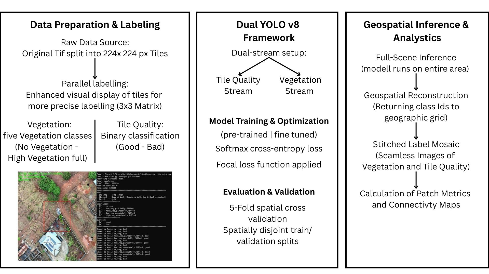

# Vegetation Type Classification Pipeline

This repository contains the `vegetation_classification.py` pipeline for classifying vegetation and quality from tiled UAV aerial imagery of Freetown, Sierra Leone, using pretrained YOLOv8 model architectur from Ultralytics




## Overview

The pipeline handles the entire workflow:
1.  **Labeling**: Interactive GUI for manual context-aware labeling.
2.  **Training**: Training YOLOv8 classification models.
3.  **Stitching**: Recombining tiles into a large mosaic map (including a label map).
4.  **Cross-Validation**: Spatial K-Fold cross-validation to assess model performance and geographic bias.
5.  **Inference**: Running predictions on full datasets.
6.  **Inspection**: Visualizing sample predictions for quality control.

## Requirements

- Python 3.8+
- `ultralytics` (YOLOv8)
- `opencv-python`
- `pillow`
- `numpy`, `pandas`, `matplotlib`
- `scikit-learn` (for spatial clustering in CV)

Install dependencies:
```bash
pip install ultralytics opencv-python pillow numpy pandas matplotlib scikit-learn tqdm
```

Alternatively the provide venv enviroment can be used

## Usage

The script is controlled via terminal commands using the `--stage` argument.

### 1. Labeling (GUI)
Open the interactive labeling window. You will see a 3x3 context grid around the center tile, which is to be labeled.
```bash
python vegetation_classification.py --stage gui
```
**Controls:**
- `1-5`: Select Vegetation Class
- `q/w`: Select Quality Class (`good`/`bad`)
- `Enter`: Save and Next
- `Space`: Skip
- `Esc`: Quit

To **reset** all labels (start fresh):
```bash
python vegetation_classification.py --stage gui --reset
```

### 2. Stitching
Stilches the original tiles and the predicted labels into large mosaic TIFFs.
```bash
python vegetation_classification.py --stage stitch --downscale 4
```
*Note:* 
- For adding the predicted labels the inference fisrt has to be run.
- The output maps are saved as BigTIFF to support large file sizes.

### 3. Spatial Cross-Validation (CV)
Run 5-Fold Spatial Cross-Validation. This clusters tiles geographically to prevent data leakage between train/val sets.
It creates a visualization of the clusters at the end.
```bash
python vegetation_classification.py --stage cv --epochs 10
```

### 3. Training
Train the final models (`veg_model.pt` and `qual_model.pt`) on all available labeled data.
```bash
python vegetation_classification.py --stage train --epochs 20 --task all
```
*Options:* `--task veg` or `--task qual` to train only one model.

### 4. Inference
Run inference on all tiles in the `datasets/all_tiles` directory using the trained models. Generates grid files (`.npy`) and maps (`.tif`).
```bash
python vegetation_classification.py --stage infer
```

### 6. Inspection
Generate summary plots of random samples for each class to visually verify model performance.
```bash
python vegetation_classification.py --stage inspect --samples 10
```

### Run All
Execute Training -> Inference -> Stitching in sequence.
```bash
python vegetation_classification.py --stage all
```

## File Structure
- `datasets/all_tiles`: Input image tiles (must be named `..._r{row}_c{col}.ext`)
- `datasets/cls_pool`: Labeled data sorted by class.
- `models/`: Saved model weights.
- `outputs/`: Inference grids, maps, stitched mosaics, and inspection plots.
